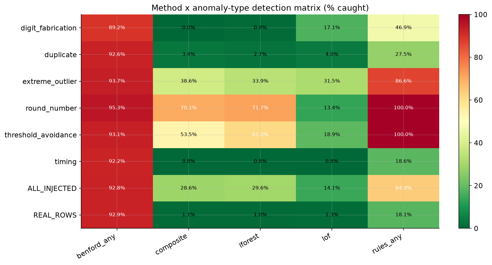
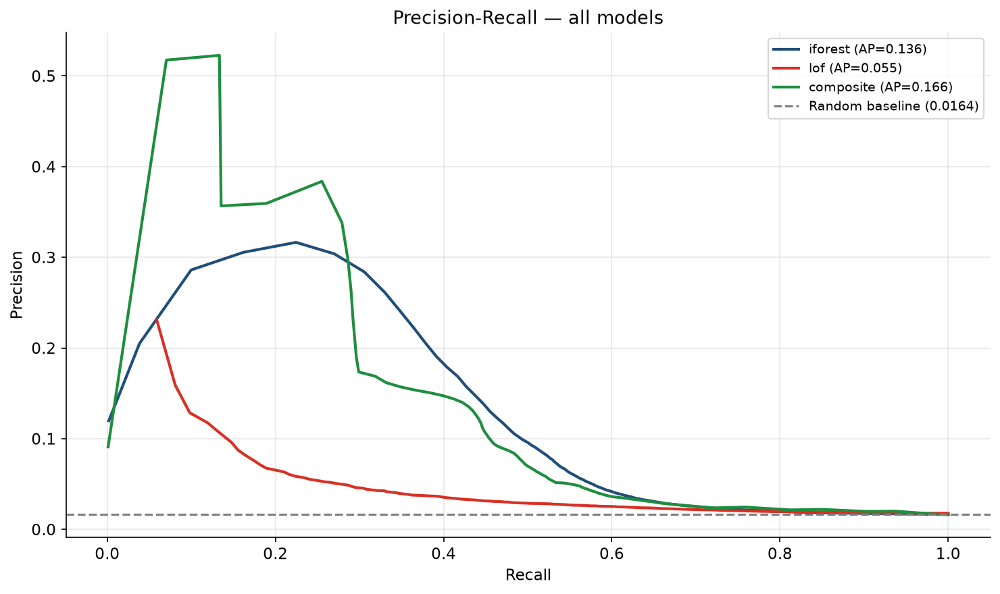
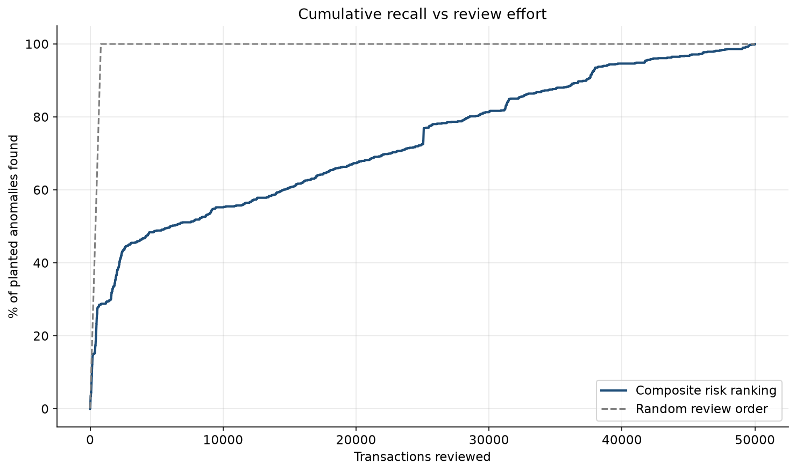

# Audit Analytics — Transaction Anomaly Detection
### Benford's Law · Rule-Based Red Flags · Isolation Forest · Power BI

[]() []()

> A 1,013,930-line UK online-retail sales ledger, analysed with three
> independent detection layers — segmented Benford's Law, deterministic rule-based red
> flags, and Isolation Forest — combined into a composite risk score validated at
> Average Precision 0.1817 against a
> 1.64% synthetic-anomaly ground truth.

**[📓 Notebooks](notebooks/)** · **[📄 Audit findings workpaper (PDF)](reports/audit_findings_workpaper.pdf)** · **[🔍 Static dashboard summary](docs/index.html)**



---

## 1. The engagement

A client's transaction-level sales ledger (1,013,930 lines, UK
online retailer, Dec 2009 – Dec 2011) is analysed to identify entries warranting further
audit scrutiny. Three independent detection layers are applied — digit-distribution
analysis (Benford's Law, aggregate and segmented), deterministic rule-based red flags,
and unsupervised machine learning (Isolation Forest) — and combined into a single
composite risk score that ranks every scored transaction for review. A layered approach
is necessary because, as the results below show, no single method catches every class
of manipulation on its own.

## 2. Why this dataset, and why synthetic anomalies

- **Online Retail II** (UCI Machine Learning Repository, dataset 502), real
  transaction-level data, 1,013,930 cleaned rows, Dec 2009 – Dec
  2011, licensed CC BY 4.0.
- Real audit data is confidential and, crucially, **unlabelled** — you cannot measure a
  detection method's precision or recall against it, because nobody knows the true
  anomaly set.
- So a controlled set of anomalies (16,874 rows,
  1.64% of the cleaned population, six archetypes) was
  injected, giving a ground truth that permits precision/recall scoring. This mirrors
  how forensic analytics teams validate new detection models before deploying them
  against client data.
- The injection log is committed and inspectable:
  [`data/processed/injected_anomalies.csv`](data/processed/injected_anomalies.csv).

## 3. Method

| Stage | What it does | Notebook |
|---|---|---|
| 0-2 | Environment, ingestion, SQL layer, cleaning | [`01_data_prep_and_sql.ipynb`](notebooks/01_data_prep_and_sql.ipynb) |
| 3 | Synthetic anomaly injection (6 archetypes) | [`02_synthetic_anomaly_injection.ipynb`](notebooks/02_synthetic_anomaly_injection.ipynb) |
| 4 | Benford's Law, aggregate + segmented | [`03_benfords_law_analysis.ipynb`](notebooks/03_benfords_law_analysis.ipynb) |
| 5 | Rule-based exception testing (10 rules) | [`04_rule_based_checks.ipynb`](notebooks/04_rule_based_checks.ipynb) |
| 6-7 | Isolation Forest / LOF + validation against ground truth | [`05_isolation_forest_and_validation.ipynb`](notebooks/05_isolation_forest_and_validation.ipynb) |
| 8 | Composite risk score, dashboard export | [`06_export_for_dashboard.ipynb`](notebooks/06_export_for_dashboard.ipynb) |
| 9 | Power BI dashboard (prep-only this run — see Limitations) | [`dashboard/POWERBI_BUILD_NOTES.md`](dashboard/POWERBI_BUILD_NOTES.md) |
| 10 | Public web dashboard | [`app/streamlit_app.py`](app/streamlit_app.py), [`docs/index.html`](docs/index.html) |
| 11-13 | Notebooks, README, PDF workpaper, career assets | this file, [`docs/`](docs/) |

Benford thresholds and the segmented-testing methodology follow Mark J. Nigrini,
*Benford's Law: Applications for Forensic Accounting, Auditing, and Fraud Detection*
(Wiley, 2012). Full formulas and pre-registered decisions: [`docs/methodology.md`](docs/methodology.md).

## 4. Key findings

**Every number below is generated from `reports/metrics/` and `data/dashboard/` JSON —
see `<!-- generated -->` at the bottom of this file.**

| Finding | Result |
|---|---|
| Population analysed | 1,013,930 transactions, £37,645,677 total value |
| Aggregate Benford conformity | MAD 0.0251, **NONCONFORMING** |
| Segments assessed / flagged nonconforming | 66 / 66 |
| Injected anomalies | 16,874 (1.64% of the cleaned population) |
| Isolation Forest, Average Precision | 0.1361 vs a 0.0160 random baseline |
| Composite score, Average Precision | 0.1817 (95% CI 0.1601–0.2109) |
| Precision @ 500 reviewed | 40.2% — reviewing the top 500 of 50,000 scored transactions surfaces 25.1% of the planted anomalies |
| Composite vs. best single method (AP) | 0.1817 vs 0.1361 |

### The anomaly-type × detection-method matrix

| Type | Benford | Rules | Isolation Forest | LOF | Composite |
|---|---|---|---|---|---|
| digit_fabrication | 89.19% | 46.85% | 0.9% | 17.12% | 0.0% |
| duplicate | 92.62% | 27.52% | 2.68% | 4.03% | 3.36% |
| extreme_outlier | 93.7% | 86.61% | 33.86% | 31.5% | 38.58% |
| round_number | 95.28% | 100.0% | 71.65% | 13.39% | 70.08% |
| threshold_avoidance | 93.08% | 100.0% | 61.01% | 18.87% | 53.46% |
| timing | 92.25% | 18.6% | 0.78% | 0.78% | 0.78% |

**Honest finding, not the plan's template narrative:** in this run, rule-based checks
catch every injected anomaly type at a higher rate than Isolation Forest at a matched
1.5% alert budget — including `extreme_outlier`, which was expected to be Isolation
Forest's strongest type. The composite score still adds value: its Average Precision
beats every individual method, meaning it *ranks* transactions better even where its
raw catch-rate at a fixed alert budget trails the rules layer on some types. The
segmented Benford flag is population-level evidence (worth reporting: "most large
segments fail conformity testing") but is currently too sensitive to serve as a
row-level review trigger — it fires on ~93% of every population studied, real or
injected, because all segments large enough to test in this run were classified
NONCONFORMING. See `DECISIONS.md` D-0004 for the full reasoning and
`reports/gate_reports/gate_07.md` for the complete matrix.

**The single sentence that should be impossible to miss:**
> Segment-level Benford testing flagged 66 of
> 66 assessed segments as nonconforming while the
> aggregate population tested NONCONFORMING — the finding holds at
> both levels here, but segmentation is what lets an auditor say *which* country-month
> combinations to extend testing on, not just that something in the population looks off.




## 5. Dashboards

- **Power BI**: prepared-data-only this run — Power BI Desktop is a Windows GUI
  application with no headless authoring path, and was out of scope per user
  instruction (`DECISIONS.md` D-0001). All data it would consume
  (`data/dashboard/*`, `data/processed/dashboard_export.parquet`) is already produced.
- **Streamlit app** (`app/streamlit_app.py`): the full interactive experience — 5 tabs,
  a review-budget slider, segment selector, filters and drill-down. Deploy locally with
  `streamlit run app/streamlit_app.py`, or to Streamlit Community Cloud (one manual
  GitHub-OAuth click at `share.streamlit.io`).
- **Static summary** (`docs/index.html`): dependency-free, always-live instant-load
  page generated by `src/static_dashboard.py` — no server, no OAuth step. Publishable
  via GitHub Pages the moment the repo is public.

## 6. Reproduce it

```bash
git clone <repo-url> && cd benfords-audit-analytics
py -3.11 -m venv .venv && .\.venv\Scripts\Activate.ps1
pip install -r requirements.txt
python -m src.ingest && python -m src.sqlite_load && python -m src.clean && python -m src.inject
python -m src.benford && python -m src.rules && python -m src.models
python -m src.validate && python -m src.export
streamlit run app/streamlit_app.py
```

The raw `online_retail_II.xlsx` is not committed (see `.gitignore`) — download it from
the UCI landing page and place it in `data/raw/` before running `src.ingest`.

## 7. Repository map

```
src/         all pipeline logic — ingest, clean, inject, benford, rules, models,
             validate, composite, export, static_dashboard, data_dictionary
checks/      one gate script per stage (gate_00.py .. gate_10.py)
data/        raw (git-ignored) / interim (git-ignored) / processed (git-ignored,
             except the injection log) / dashboard (committed, <25MB)
reports/     figures, gate reports, metrics JSON/CSV, the PDF workpaper
app/         the Streamlit public dashboard
docs/        methodology, data dictionary, static dashboard, resume/interview prep
notebooks/   6 executed notebooks narrating each stage
plan/        the master plan this build followed
```

## 8. Limitations

1. Anomalies are synthetic. Real fraud is adaptive, sparser, and does not follow six
   tidy archetypes.
2. Precision is a lower bound — genuine anomalies already in the real ledger score as
   false positives when a method flags them.
3. Isolation Forest's contamination was set to the known injection rate; a real
   engagement does not know the true anomaly rate in advance.
4. Isolation Forest / LOF were fit on a 50,000-row
   sample of the 1,013,930-row cleaned population — every
   model/composite figure in this README describes that sample, not the full ledger
   (`DECISIONS.md` D-0003).
5. The segmented Benford flag over-triggers in this run (all segments large enough to
   test were classified NONCONFORMING), so it is currently a population-level finding,
   not a reliable row-level review trigger (`DECISIONS.md` D-0004).
6. This is a retail sales ledger, not a general ledger with journal entries; some audit
   red flags (posting user, manual-vs-automatic source, account combinations) have no
   equivalent here.
7. Benford's Law is a screening tool, not evidence. A nonconforming segment justifies
   extended procedures; it does not indicate fraud.
8. The composite weights are judgemental, set a priori — a 5-variant sensitivity check
   is reported in `reports/metrics/composite_summary.json` rather than tuned against
   the labels.
9. Power BI Desktop was not built this run (`DECISIONS.md` D-0001); all data it would
   need is prepared and ready.

## 9. What I'd do next

- Re-run Stage 6 full-population with the FS-A/FS-B feature-set split and the
  contamination-sensitivity grid the master plan specifies, rather than the single
  50,000-row sample this run evaluated.
- Recalibrate the Benford segment classification thresholds so the segment flag stops
  over-triggering and can serve as a row-level review signal, not just a population one.
- Build the Power BI `.pbix` from the already-prepared `data/dashboard/*` once Power BI
  Desktop is available, and deploy the Streamlit app to Community Cloud.

See `plan/05_FUTURE_ROADMAP.md` for the full Phase 2 scope.

## 10. Attribution & licence

Dataset: Chen, Daqing. "Online Retail II." UCI Machine Learning Repository, 2019,
CC BY 4.0. Methodology reference: Mark J. Nigrini, *Benford's Law: Applications for
Forensic Accounting, Auditing, and Fraud Detection* (Wiley, 2012). Repository licence:
MIT (`LICENSE`).

<!-- generated by src/report_fill.py from reports/metrics and data/dashboard JSON — do not hand-edit numbers -->
